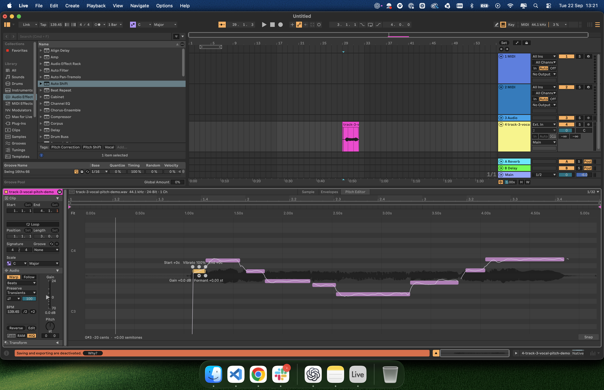

# Ableton Pitch Editor

Edit vocal notes directly in Ableton’s Clip View. Drag to change pitch, audition notes, and adjust gain, vibrato, drift and formants.

[Watch the demo](https://x.com/jacobbinnie/status/2102091733114745280)



## Before you start

You need an **Apple Silicon Mac**, **Max for Live**, **Python 3.12+**, and **Xcode Command Line Tools** (`xcode-select --install`).

Currently tested: **Live 12.4.5 Trial** (`2026-08-19_225ce5e356`) and **12.4.6 Trial** (`2026-09-10_0de5c8fa9a`). Trial is not inherently required, but paid editions are untested. Setup stops if your exact build is unsupported.

## Install

**Close Ableton**, then paste this into Terminal. Setup backs up and patches your installed app.

```sh
git clone https://github.com/jacobbinnie/ableton-pitch-editor.git &&
cd ableton-pitch-editor &&
python3 scripts/setup.py --check &&
mkdir -p vendor build &&
git clone https://github.com/Cycling74/max-sdk-base.git vendor/max-sdk-base &&
git -C vendor/max-sdk-base checkout --detach c03a2922a2a8ff149165a1e2ea134e9321d6e202 &&
SSL_CERT_FILE=/etc/ssl/cert.pem python3 scripts/fetch_rubberband.py &&
python3 scripts/setup.py
```

Multiple Live installations? Add `--live "/path/to/Ableton Live.app"` to both setup commands. Setup needs write permission for that app.

## Open the editor

1. Reopen Ableton. Add a vocal to **Arrangement View** and turn on **Warp**.
2. Drag `build/Native Pitch Editor.amxd` onto the **same track**. Leave `pitchnative42.mxo` beside the device file.
3. Double-click the vocal clip, then click **Pitch Editor** beside Sample and Envelopes.

Drag notes to edit or audition. Shift-drag fine-tunes. ⌘Z undoes edits while the editor has focus.

**Missing tab?** Open the app selected by setup. **Disabled tab?** Load the device on the vocal’s track.

## Remove

Close Ableton and run this from the repo folder:

```sh
python3 scripts/setup.py --restore
```

Use the same `--live` option if needed, then remove the device from your tracks.

## Limitations

Experimental. **Edits do not reliably survive restarting Live and are not saved in your Set.** Use test projects. Supports warped Arrangement audio only: mono/stereo, 8–48 kHz, up to 60 seconds. Live updates may need a new compatibility profile; authorization is unchanged.

[Technical details](docs/live-audio.md) · [Edit recovery](docs/edit-retention.md)

Unofficial; not affiliated with Ableton. No project-wide license selected. Rubber Band and Max SDK retain their own licenses. Ableton app files and recordings are not included.
